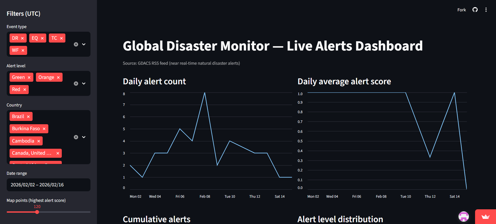

# Global Disaster Monitor — Live Alerts Dashboard

A real-time **data science dashboard** built with **Streamlit** that monitors global natural disaster alerts using the **GDACS (Global Disaster Alert and Coordination System)** RSS feed.

The application fetches near real-time disaster data, parses and cleans the XML feed, performs time-series analysis, and presents interactive visualizations with filtering capabilities.

---

## 🔗 Live Demo

👉 **[https://global-disaster-live-monitor.streamlit.app](https://global-disaster-live-monitor.streamlit.app)**

---

## 📸 Dashboard Preview



*Interactive dashboard showing daily alert trends, severity distributions, event type breakdowns, and geographic mapping of high-severity alerts.*

---

## 🚀 Quick Start

### Prerequisites
- Python 3.8+

### Installation

1. **Clone the repository**
   ```bash
   git clone https://github.com/NadimBaboun/Global-Disaster-Live-Monitor.git
   cd Global-Disaster-Live-Monitor
   ```

2. **Install dependencies**
   ```bash
   pip install -r requirements.txt
   ```

3. **Run the application**
   ```bash
   streamlit run app.py
   ```

4. **Open your browser** to `http://localhost:8501`

---

## 📊 Key Features

### Data Pipeline
- **Live XML ingestion** from GDACS RSS feed with robust error handling
- **Network resilience**: Automatic fallback to cached CSV on fetch failures
- **Data validation**: Detects and rejects HTML/malformed responses before parsing

### Data Processing
- XML parsing with namespace handling (`geo:Point`, `gdacs:eventtype`, etc.)
- Timezone-aware datetime conversions (RFC-822 → UTC)
- Unified event time field (`from_date` preferred, `pub_date` fallback)
- Missing value handling (`NaN` → `"Unknown"` for categorical fields)

### Interactive Dashboard
- **Multi-filter system**: Event type, alert level, country, date range
- **KPI sidebar**: Quick-glance aggregate metrics
- **12+ chart types**: Line, bar, pie, boxplot, stacked bar, geographic map
- **Dark-themed UI**: Custom matplotlib styling for readability

---

## 🗂️ Project Structure

```
📁 Global-Disaster-Live-Monitor/
├── assets/               # Screenshots and media
├── app.py                # Streamlit UI (filters, charts, layout)
├── data.py               # Data layer (fetch, parse, cache)
├── chart_utils.py        # Dark-themed chart helpers
├── requirements.txt      # Python dependencies
├── .gitignore            # Excluded files (cache, bytecode, etc.)
└── README.md
```

### Code Organization

| File | Responsibility | Key Functions |
|---|---|---|
| **`data.py`** | Data fetching & caching | `fetch_gdacs_rss_xml()`, `rss_to_df()`, `load_data_with_cache()` |
| **`chart_utils.py`** | Chart styling | `dark_chart()` context manager, `darken_fig()` |
| **`app.py`** | UI layout & filters | Streamlit components, filter logic, chart rendering |

---

## 🌐 Data Source

**GDACS (Global Disaster Alert and Coordination System)**  
📍 [https://www.gdacs.org/xml/rss.xml](https://www.gdacs.org/xml/rss.xml)

GDACS provides real-time alerts for:
- 🌍 Earthquakes
- 🌊 Floods
- 🌀 Tropical cyclones
- 🔥 Wildfires
- 🌋 Volcanic activity

---

## 🛠️ Technical Highlights

### Error Handling
- **Specific exception catching**: `requests.RequestException`, `ET.ParseError`, `ValueError` (avoids swallowing real bugs)
- **Logging integration**: Failed fetches are logged for debugging on Streamlit Cloud
- **Cache write isolation**: Disk errors don't prevent showing fresh data

### Performance
- **Streamlit caching**: `@st.cache_data(ttl=600)` for RSS fetches
- **Pre-computed aggregates**: Daily counts/scores computed once and reused
- **Efficient filtering**: Single boolean mask for all sidebar selections

### Code Quality
- **Separation of concerns**: Data layer, UI layer, chart utilities in separate modules
- **Comprehensive docstrings**: All public functions documented
- **Inline comments**: Explain *why*, not *what* (e.g., "prefer from_date so charts reflect event timing, not reporting delay")

---

## 📈 Data Science Concepts Demonstrated

- **Data ingestion** from external APIs (RSS/XML)
- **XML parsing** with namespace handling
- **Data cleaning** and type conversion (datetime, numeric coercion)
- **Feature engineering** (unified event time, categorical encoding)
- **Time-series analysis** (daily aggregates, rolling averages, cumulative sums)
- **Exploratory data analysis** (distributions, trends, geographic patterns)
- **Interactive visualization** (filters, multi-chart dashboards)

---

## 📝 License

This project is for educational and portfolio purposes.

---

## 🙋 Author

**Nadim Baboun**  
🔗 [GitHub Profile](https://github.com/NadimBaboun)